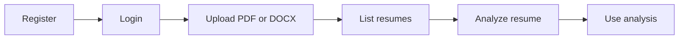

# AI Resume Analyzer API

> API reference for resume analysis, job discovery, job matching, and career guidance.

| Property | Value |
| --- | --- |
| Version | `1.0.0` |
| Framework | FastAPI |
| API standard | OpenAPI 3.1 |
| Database | SQLite via SQLAlchemy |
| Authentication | JWT in an HTTP-only cookie |
| Base URL | `http://127.0.0.1:8000` |
| Swagger UI | [Open Swagger UI](http://127.0.0.1:8000/docs) |
| OpenAPI JSON | [OpenAPI specification](http://127.0.0.1:8000/openapi.json) |

## Contents

- [Quick Start](#quick-start)
- [Conventions](#conventions)
- [Endpoint Index](#endpoint-index)
- [Authentication](#authentication)
- [Root Endpoint](#root-endpoint)
- [Resume Endpoints](#resume-endpoints)
- [Job Endpoints](#job-endpoints)
- [Matching Endpoint](#matching-endpoint)
- [Career Advisor Endpoints](#career-advisor-endpoints)
- [Schemas](#schemas)
- [Workflows](#workflows)
- [Implementation Notes](#implementation-notes)
- [Errors](#errors)
- [Security](#security)

## Quick Start

Start the API from the `backend` directory:

```bash
python -m uvicorn main:app --reload
```

Then open [Swagger UI](http://127.0.0.1:8000/docs). The API uses cookies for authentication, so browser requests retain the session automatically. For cURL, save the cookie returned by login in `cookies.txt` and send it with protected requests.

## Conventions

### Base URL

```text
http://127.0.0.1:8000
```

### Authentication legend

| Label | Meaning |
| --- | --- |
| Public | No authentication required. |
| User | A valid `access_token` cookie is required. |
| Employer | A valid cookie and the `employer` role are required. |
| Owner | A valid cookie and ownership of the resource are required. |

### Authentication details

- Cookie name: `access_token`
- Token algorithm: `HS256`
- Cookie lifetime: 30 minutes
- Cookie flags: `HttpOnly`, `SameSite=Lax`
- The API does not use the `Authorization: Bearer` header.
- The frontend must send requests with `credentials: "include"`.

### Common headers

JSON requests:

```http
Content-Type: application/json
```

Resume uploads use `multipart/form-data` and must contain a field named `file`.

## Endpoint Index

| Method | Endpoint | Access | Description |
| :---: | --- | --- | --- |
| `GET` | `/` | Public | Return the API welcome message. |
| `POST` | `/Register` | Public | Create a user account. |
| `POST` | `/login` | Public | Authenticate and set the JWT cookie. |
| `GET` | `/me` | User | Return the current user. |
| `POST` | `/logout` | User | Delete the JWT cookie. |
| `POST` | `/resumes/upload` | User | Upload a PDF or DOCX resume. |
| `GET` | `/resumes/` | User | List the current user's resumes. |
| `POST` | `/resumes/{resume_id}/analyze` | User | Analyze a user-owned resume. |
| `POST` | `/jobs/` | Employer | Create a job. |
| `GET` | `/jobs/` | Public | List all jobs. |
| `GET` | `/jobs/search` | Public | Search jobs by keyword. |
| `GET` | `/jobs/{job_id}` | Public | Retrieve one job. |
| `PUT` | `/jobs/{job_id}` | Owner | Update an owned job. |
| `DELETE` | `/jobs/{job_id}` | Owner | Delete an owned job. |
| `POST` | `/job-matching/resume/{resume_id}` | User | Match an analyzed resume against all jobs. |
| `POST` | `/career-advisor/ask` | User | Ask a RAG-backed career question. |
| `POST` | `/career-advisor/roadmap` | User | Generate a learning roadmap. |

## Authentication

### Register

#### `POST /Register`

Creates an account. The path is case-sensitive and intentionally uses an uppercase `R`.

**Request body: `UserCreate`**

```json
{
  "email": "candidate@example.com",
  "username": "candidate",
  "password": "securepassword",
  "role": "job_seeker"
}
```

`password` must contain at least 8 characters. `role` is optional and defaults to `job_seeker`; accepted values are `job_seeker` and `employer`.

**Response: `201 Created`**

```json
{
  "id": 1,
  "email": "candidate@example.com",
  "username": "candidate",
  "role": "job_seeker"
}
```

**Errors:** `400` for a duplicate email, duplicate username, or invalid role; `422` for invalid request data.

### Login

#### `POST /login`

Authenticates a user and sets the `access_token` cookie.

**Request body: `userLogin`**

```json
{
  "email": "candidate@example.com",
  "password": "securepassword"
}
```

**Response: `200 OK`**

```json
{
  "message": "Login successful"
}
```

The response also contains a `Set-Cookie` header. **Errors:** `400` for invalid credentials; `422` for invalid request data.

### Current user

#### `GET /me`

| Requirement | Value |
| --- | --- |
| Access | User |
| Response | `UserResponse` |
| Success | `200 OK` |
| Error | `401 Unauthorized` |

```bash
curl -b cookies.txt http://127.0.0.1:8000/me
```

### Logout

#### `POST /logout`

Requires a valid cookie and deletes it.

```json
{
  "message": "Logged out successfully"
}
```

**Responses:** `200 OK` on success; `401 Unauthorized` when the cookie is missing or invalid.

## Root Endpoint

#### `GET /`

Public health-style welcome response.

```json
{
  "message": "Welcome to AI Resume Analyzer API"
}
```

## Resume Endpoints

### Upload a resume

#### `POST /resumes/upload`

| Requirement | Value |
| --- | --- |
| Access | User |
| Content type | `multipart/form-data` |
| Form field | `file` (PDF or DOCX) |
| Success | `201 Created` |
| Errors | `400`, `401`, `422` |

The file is saved in `uploads/` with a UUID filename and associated with the authenticated user.

```bash
curl -b cookies.txt -X POST http://127.0.0.1:8000/resumes/upload \
  -F "file=@./resume.pdf"
```

```json
{
  "id": 1,
  "resume_file": "uploads/2d2f3e8b-1234-4567-8901-abcdef123456.pdf",
  "user_id": 1
}
```

Only `.pdf` and `.docx` files are accepted.

### List my resumes

#### `GET /resumes/`

Returns an array of `ResumeResponse` objects belonging to the authenticated user. An empty array is valid.

**Responses:** `200 OK`; `401 Unauthorized`.

### Analyze a resume

#### `POST /resumes/{resume_id}/analyze`

| Parameter | Location | Type | Required |
| --- | --- | --- | :---: |
| `resume_id` | Path | integer | Yes |
| `access_token` | Cookie | string | Yes |

Extracts text, sends it to the configured Hugging Face model, and creates or updates the resume analysis.

**Response: `200 OK`**

```json
{
  "id": 1,
  "skills": ["Python", "FastAPI", "SQL"],
  "experience": "Backend development experience.",
  "education": "Bachelor's degree in Computer Science.",
  "summary": "Software engineer focused on Python and AI.",
  "resume_id": 1
}
```

**Errors:** `400` when no text can be extracted; `401` when unauthenticated; `404` when the resume is not owned by the current user; `422` for an invalid ID; `500` for an unexpected parser, model, or database failure.

```bash
curl -b cookies.txt -X POST http://127.0.0.1:8000/resumes/1/analyze
```

## Job Endpoints

### Create a job

#### `POST /jobs/`

Employer-only endpoint. `title` requires at least 2 characters and `content` requires at least 10 characters.

**Request body: `JobCreate`**

```json
{
  "title": "Machine Learning Engineer",
  "content": "Build and deploy machine learning services for production applications.",
  "required_skills": ["Python", "Machine Learning", "SQL"]
}
```

**Responses:** `201 Created`; `401 Unauthorized`; `403 Forbidden` for non-employers; `422 Unprocessable Entity`; `500 Internal Server Error`.

### List jobs

#### `GET /jobs/`

Public endpoint. Returns an array of `JobResponse` objects. An empty array is valid.

### Search jobs

#### `GET /jobs/search?keyword={keyword}`

Public, case-insensitive search across job titles, descriptions, and required skills. `keyword` is optional; when omitted, all jobs are returned.

```bash
curl "http://127.0.0.1:8000/jobs/search?keyword=python"
```

### Get a job

#### `GET /jobs/{job_id}`

Public endpoint that returns one `JobResponse`.

**Responses:** `200 OK`; `404 Not Found` when the job does not exist; `422 Unprocessable Entity` for an invalid ID.

### Update a job

#### `PUT /jobs/{job_id}`

Owner-only endpoint. The authenticated user must be an employer who owns the job. All fields are optional, but supplied `title` and `content` must meet their minimum lengths.

**Request body: `JobUpdate`**

```json
{
  "title": "Senior Machine Learning Engineer",
  "content": "Lead the development and deployment of machine learning services.",
  "required_skills": ["Python", "FastAPI", "SQL"]
}
```

**Responses:** `200 OK`; `401 Unauthorized`; `403 Forbidden`; `404 Not Found`; `422 Unprocessable Entity`; `500 Internal Server Error`.

### Delete a job

#### `DELETE /jobs/{job_id}`

Owner-only endpoint. Returns the following response:

```json
{
  "message": "Job deleted successfully"
}
```

**Responses:** `200 OK`; `401 Unauthorized`; `403 Forbidden`; `404 Not Found`; `422 Unprocessable Entity`; `500 Internal Server Error`.

## Matching Endpoint

### Match a resume with jobs

#### `POST /job-matching/resume/{resume_id}`

Requires an analyzed resume owned by the current user. The endpoint compares it with every job and sorts recommendations by descending score.

**Response when jobs exist: `200 OK`**

```json
{
  "resume_id": 1,
  "recommendations": [
    {
      "job_id": 1,
      "title": "Machine Learning Engineer",
      "score": 66.67,
      "matched_skills": ["Python", "SQL"],
      "missing_skills": ["Machine Learning"],
      "reason": "Matched 2 out of 3 required skills"
    }
  ]
}
```

When no jobs exist, `recommendations` is empty and the response also contains `"message": "No jobs available"`.

**Errors:** `400` when the resume has not been analyzed; `401` when unauthenticated; `404` when the resume is not owned by the current user; `422` for an invalid ID; `500` for an unexpected database failure.

Scores use exact, case-insensitive skill comparison after trimming whitespace:

```text
score = matched_required_skills / total_required_skills * 100
```

The score is rounded to two decimal places. Jobs with no required skills receive `0.0`.

## Career Advisor Endpoints

Both endpoints require an analyzed resume owned by the current user. The advisor uses the knowledge base, Sentence Transformers, FAISS retrieval, and Google Gemini.

### Ask a career question

#### `POST /career-advisor/ask`

**Request body: `CareerQuestion`**

```json
{
  "resume_id": 1,
  "question": "What should I learn next to become an AI Engineer?"
}
```

**Response: `200 OK`**

```json
{
  "resume_id": 1,
  "question": "What should I learn next to become an AI Engineer?",
  "user_skills": ["Python", "SQL"],
  "matched_skills": ["python", "sql"],
  "missing_skills": ["apis", "deep learning", "git", "machine learning", "pytorch", "tensorflow"],
  "answer": "Career advice generated from the knowledge base."
}
```

**Errors:** `400` when the resume has not been analyzed; `401`; `404`; `422`; `500` for an embedding, Gemini, or database failure.

### Generate a roadmap

#### `POST /career-advisor/roadmap?resume_id={resume_id}`

`resume_id` is a required query parameter, not a JSON body field. The route generates a roadmap for missing AI Engineer skills.

**Response when skills are missing: `200 OK`**

```json
{
  "resume_id": 1,
  "title": "Your AI Engineer Learning Path",
  "goal": "Build the missing skills needed for an AI Engineer role.",
  "missing_skills": ["apis", "git"],
  "steps": [
    {
      "step": 1,
      "title": "Learn APIs",
      "skill": "apis",
      "description": "Learn the core concepts.",
      "topics": ["REST APIs"],
      "projects": ["Build an API"],
      "resources": ["API resources"],
      "duration": "4 weeks",
      "level": "Foundation"
    }
  ],
  "total_steps": 1
}
```

When no skills are missing, the response contains `steps: []`, `total_steps: 0`, `missing_skills: []`, `matched_skills`, and a completion `message`.

**Errors:** `400` when the resume has not been analyzed; `401`; `404`; `422` for a missing or invalid query parameter; `500` for an embedding, Gemini, or database failure.

## Schemas

### `UserCreate`

| Field | Type | Required | Rules |
| --- | --- | :---: | --- |
| `email` | string | Yes | Valid email format. |
| `username` | string | Yes | User name. |
| `password` | string | Yes | Minimum 8 characters. |
| `role` | string | No | Defaults to `job_seeker`; `job_seeker` or `employer`. |

### `userLogin`

| Field | Type | Required | Rules |
| --- | --- | :---: | --- |
| `email` | string | Yes | Valid email format. |
| `password` | string | Yes | Minimum 8 characters. |

### `UserResponse`

| Field | Type | Required |
| --- | --- | :---: |
| `id` | integer | Yes |
| `email` | string | Yes |
| `username` | string | Yes |
| `role` | string | Yes |

### `JobCreate`

| Field | Type | Required | Rules |
| --- | --- | :---: | --- |
| `title` | string | Yes | Minimum 2 characters. |
| `content` | string | Yes | Minimum 10 characters. |
| `required_skills` | string array | No | Defaults to `[]`. |

### `JobUpdate`

| Field | Type | Required | Rules |
| --- | --- | :---: | --- |
| `title` | string or null | No | Minimum 2 characters when supplied. |
| `content` | string or null | No | Minimum 10 characters when supplied. |
| `required_skills` | string array or null | No | Replaces the existing list. |

### `JobResponse`

`JobResponse` contains `id`, `employer_id`, `title`, `content`, and `required_skills`.

### `ResumeResponse`

`ResumeResponse` contains `id`, `resume_file`, and `user_id`.

### `CareerQuestion`

| Field | Type | Required |
| --- | --- | :---: |
| `resume_id` | integer | Yes |
| `question` | string | Yes |

### FastAPI validation errors

Malformed or incomplete requests use this shape:

```json
{
  "detail": [
    {
      "loc": ["body", "password"],
      "msg": "String should have at least 8 characters",
      "type": "string_too_short"
    }
  ]
}
```

## Workflows

### Resume analysis



1. Register a `job_seeker` account.
2. Log in and retain the `access_token` cookie.
3. Upload a PDF or DOCX resume.
4. Analyze the returned resume ID.
5. Use the analysis for matching and career guidance.

### Job matching and career guidance

1. The resume must be uploaded and analyzed first.
2. Job matching compares normalized skills against all published jobs.
3. Career questions retrieve relevant knowledge-base chunks before generating an answer.
4. Roadmaps are generated for missing skills only.

## Implementation Notes

### Resume analysis

- PDF text is extracted with `pypdf.PdfReader`.
- DOCX text is extracted with `python-docx`.
- Hugging Face configuration uses `HF_API_TOKEN` and `HF_MODEL`.
- The analyzer expects exactly `skills`, `experience`, `education`, and `summary` in valid JSON.

### Career advisor RAG

- Text files are loaded recursively from `backend/knowledge_base`.
- Chunks use `chunk_size=500` and `chunk_overlap=100`.
- Embeddings use `sentence-transformers/all-MiniLM-L6-v2`.
- Retrieval uses an in-memory FAISS `IndexFlatL2` index.
- Google Gemini requires `GEMINI_API_KEY`.

### Database

The application uses SQLite through SQLAlchemy. Main tables are `users`, `resumes`, `analysis_resumes`, `jobs`, and `recommendations`. Resume files are stored on disk; the database stores their relative paths. Password hashes are never returned by the API.

## Errors

| Status | Meaning | Typical cause |
| :---: | --- | --- |
| `400` | Bad Request | Duplicate account data, invalid credentials, unsupported file, or missing analysis. |
| `401` | Unauthorized | Missing, invalid, expired, or unknown-user JWT cookie. |
| `403` | Forbidden | Wrong role or resource ownership. |
| `404` | Not Found | Job or user-owned resume does not exist. |
| `422` | Unprocessable Entity | Invalid body, path, query, email, or multipart data. |
| `500` | Internal Server Error | Unexpected parser, database, embedding, AI, or model failure. |

Application errors use this shape:

```json
{
  "detail": "Resume must be analyzed first"
}
```

## Security

- Keep `HF_API_TOKEN`, `GEMINI_API_KEY`, database credentials, and `SECRET_KEY` out of documentation and source control.
- Use a strong `SECRET_KEY`, HTTPS, and secure cookies in production.
- Do not commit `.env`, `cookies.txt`, uploaded resumes, or SQLite database files.
- Treat uploaded resumes, analyses, and generated AI responses as sensitive user data.
- Preserve ownership checks when accessing resumes, analyses, matching results, and career guidance.

---

**AI Resume Analyzer API** | Version `1.0.0`

This document describes the routes registered by the FastAPI application.
